# Digital Communication project

Simulation of the performance of different modulation schemes, BPSK, QPSK, FSK,
QAM(16-64) in an AWGN environment.

## Usage

1. Open Matlab
2. Open files with simulink
3. Tweek the AWGN channel Eb/No.
4. Type `bertool` in Matlab terminal.
5. Plot the theoretical figure.
6. In Monte Carlo tab choose the EbNo range and the scheme file then press run to get the graph.

## Files

```text
Project/
├── MODULATION_TYPE/
    ├── images/
    │   ├── MODULATION_TYPE.jpg
    │   ├── MODULATION_TYPE_fig.jpg
    │   ├── MODULATION_TYPE_with_raised.jpg
    │   └── MODULATION_TYPE_with_raised_fig.jpg
    ├── MODULATION_TYPE_with_raised.slx
    └── MODULATION_TYPE.slx
```

## BPSK

Binary Phase Shift Keying (BPSK) is a two phase modulation scheme, where the 0’s and 1’s in a binary message are represented by two different phase states in the carrier signal: θ=0∘ for binary 1 and θ=180∘ for binary 0.

### Plot

- Scatter plot of BPSK after noise: 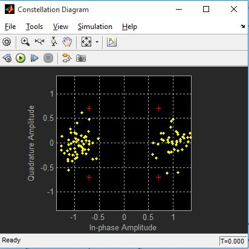
- Scatter plot of BPSK with Raised-Cosine after noise: 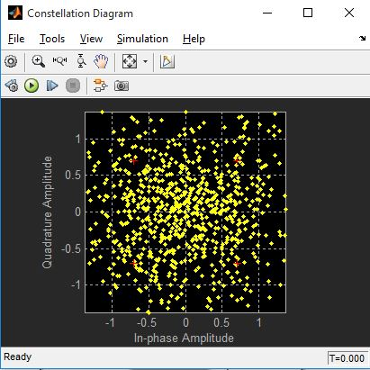

### BER Graph

- BER graph of BPSK: 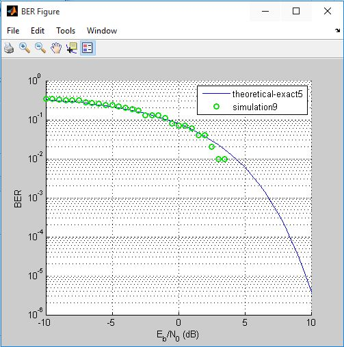
- BER graph of BPSK with Raised-Cosine: 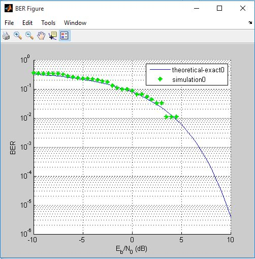

## FSK

Frequency Shift Keying (FSK) is the digital modulation technique in which the frequency of the carrier signal varies according to the digital signal changes. FSK is a scheme of frequency modulation.

### Plot

- Scatter plot of FSK after noise: 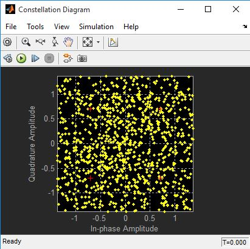
- Scatter plot of FSK with Raised-Cosine after noise: 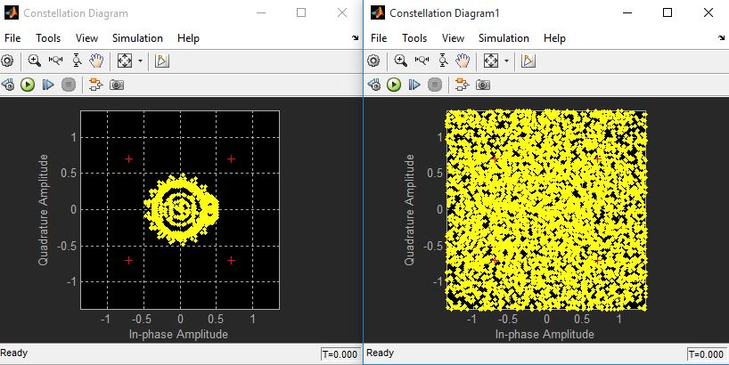

### BER Graph

- BER graph of FSK: 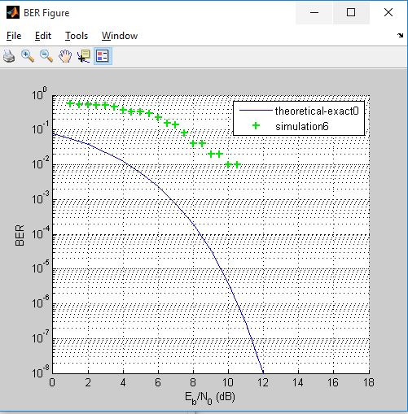
- BER graph of FSK with Raised-Cosine: 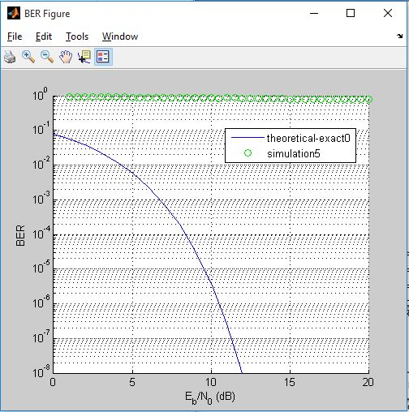

## QPSK

Quadrature Phase Shift Keying (QPSK) is a variation of BPSK, and it is also a Double Side Band Suppressed Carrier (DSBSC) modulation scheme, which sends two bits of digital information at a time, called as bigits.

### Plot

- Scatter plot of QPSK after noise: 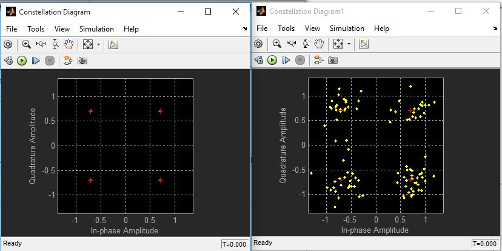
- Scatter plot of QPSK with Raised-Cosine after noise: 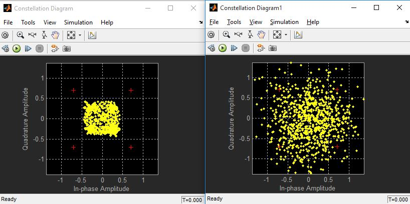

### BER Graph

- BER graph of QPSK: 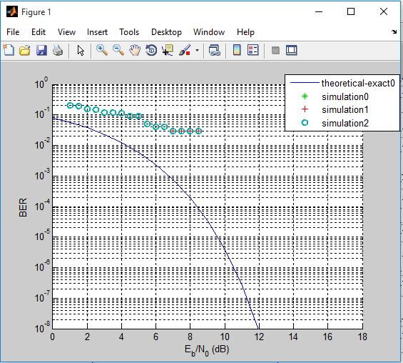
- BER graph of QPSK with Raised-Cosine: 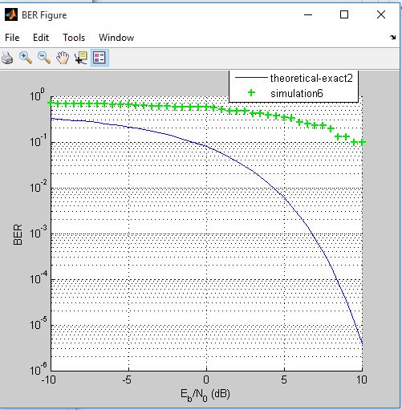

## QAM

Quadrature amplitude modulation (QAM) is the name of a family of digital modulation methods and a related family of analog modulation methods widely used in modern telecommunications to transmit information.

### 16 QAM

- Scatter plot of 16 QAM before and after noise: 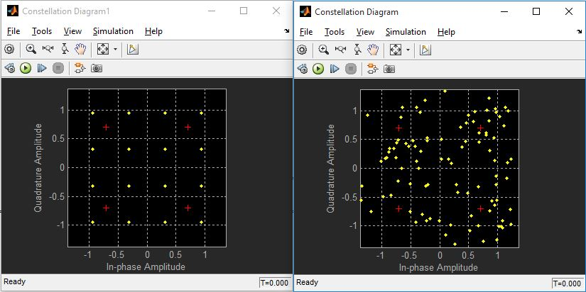
- Scatter plot of 16 QAM with Raised-Cosine before and after noise: 

### BER Graph

- BER graph of 16 QAM: 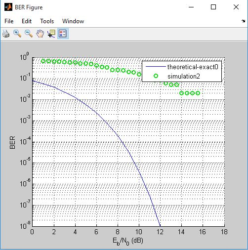
- BER graph of 16 QAM with Raised-Cosine: 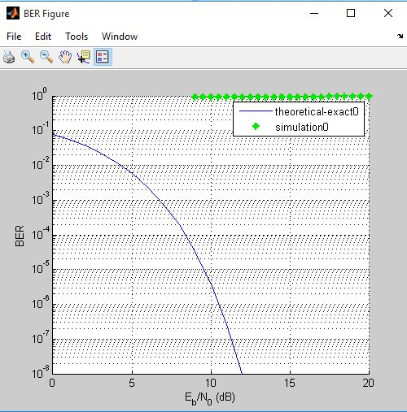

### 64 QAM

- Scatter plot of 64 QAM before and after noise: 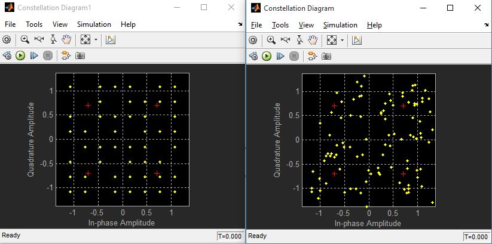
- Scatter plot of 64 QAM with Raised-Cosine before and after noise: 

### BER Graph

- BER graph of 64 QAM: 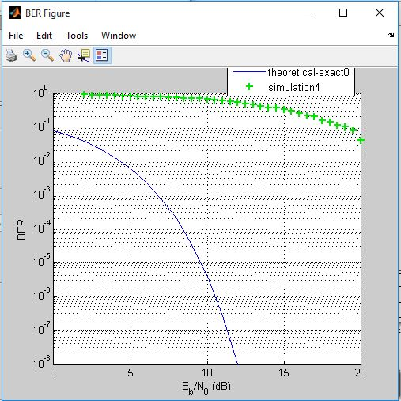
- BER graph of 64 QAM with Raised-Cosine: 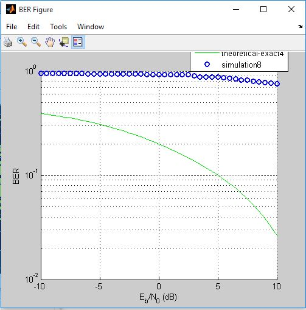

## autor

- Hady Maher